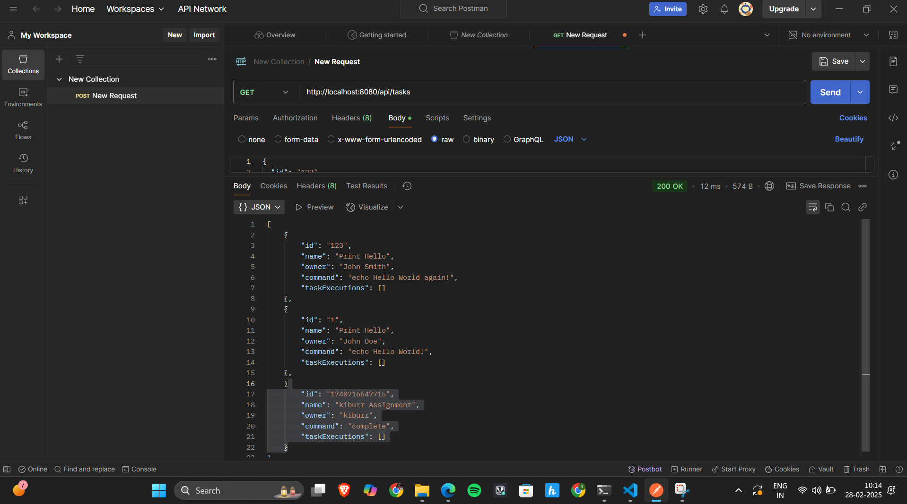

# Task Management UI

This README provides a step-by-step guide on how to create a **React 19** frontend with **TypeScript** and **Ant Design** for managing "Task" objects. This project demonstrates the use of React with Ant Design to build a user-friendly UI that integrates with the Task Management API.

## Table of Contents

- [Prerequisites](#prerequisites)
- [Project Setup](#project-setup)
- [API Configuration](#api-configuration)
- [Project Structure](#project-structure)
- [Implementation Details](#implementation-details)
  - [Task List Page](#task-list-page)
  - [Create Task Page](#create-task-page)
  - [Search Functionality](#search-functionality)
  - [Delete Task](#delete-task)
- [Testing the UI](#testing-the-ui)
  - [Task List View](#task-list-view)
  - [Create Task](#create-task)
  - [Search Task](#search-task)
  - [Delete Task](#delete-task)

## Prerequisites

- Node.js (Latest LTS version)
- npm or yarn
- React 19
- TypeScript
- Ant Design
- Task Management API (Backend from Task 1)

## Project Setup

Clone this repository to your local machine:

```sh
git clone https://github.com/your-username/task-manager-ui.git
```

Navigate into the project folder:

```sh
cd task-manager-ui
```

Install dependencies:

```sh
npm install
```

Start the development server:

```sh
npm start
```

Your UI should now be running at:

```
http://localhost:3000
```

## API Configuration

Ensure the **Task Management API (Backend from Task 1)** is running at:

```
http://localhost:8080/api/tasks
```

Modify `src/api.ts` to configure the API URL:

```typescript
const API_URL = "http://localhost:8080/api/tasks";
export default API_URL;
```

## Project Structure

### Directory Structure

- `src/`: Contains the source code and resources for the project.
  - `components/`: Reusable UI components (Navbar, Modals, etc.).
  - `pages/`: Individual page components (Task List, Create Task).
  - `api.ts`: API configuration file.
  - `App.tsx`: Main application file with routing.
- `.gitignore`: Specifies files to be excluded from version control.
- `package.json`: Project dependencies and scripts.
- `README.md`: Documentation file.

### Folder Structure

```
task-manager-ui/
│── src/
│   ├── api.ts
│   ├── App.tsx
│   ├── components/
│   │   ├── Navbar.tsx
│   ├── pages/
│   │   ├── TaskList.tsx
│   │   ├── CreateTask.tsx
│── .gitignore
│── package.json
│── README.md
```

## Implementation Details

### Task List Page

**File:** `src/pages/TaskList.tsx`

This page fetches tasks from the backend and displays them in an interactive table with a search option and delete functionality.

```tsx
<Table
  dataSource={tasks}
  columns={[
    { title: "Task Name", dataIndex: "name" },
    { title: "Owner", dataIndex: "owner" },
    { title: "Command", dataIndex: "command" },
    {
      title: "Actions",
      key: "actions",
      render: (task) => (
        <Button danger onClick={() => handleDelete(task.id)}>Delete</Button>
      ),
    },
  ]}
/>
```

### Create Task Page

**File:** `src/pages/CreateTask.tsx`

Users can create new tasks using this form. The form includes validation to ensure required fields are filled.

```tsx
<Form onFinish={handleSubmit}>
  <Form.Item label="Task Name" name="name" rules={[{ required: true }]}> <Input /> </Form.Item>
  <Button type="primary" htmlType="submit">Create Task</Button>
</Form>
```

### Search Functionality

Users can search for tasks by name using an input field and a button.

```tsx
<Input
  placeholder="Search tasks..."
  value={search}
  onChange={(e) => setSearch(e.target.value)}
/>
<Button type="primary" onClick={handleSearch}>Search</Button>
```

### Delete Task

Users can delete tasks using a delete button next to each task.

```tsx
<Button danger onClick={() => handleDelete(task.id)}>Delete</Button>
```

## Testing the UI

### Task List View


### Create Task


### Search Task


### Delete Task
Deleted the "print" task

 





---

This project demonstrates a fully functional **React UI** for managing tasks using **Ant Design**. 🚀 Feel free to extend it further!

